# claude-workflows

[](VERSION)
[](https://ragaa07.github.io/claude-workflows/)

**Structured development workflows for Claude Code — 23 skills, proportional quality gates, multi-session state, and team extensibility.**

claude-workflows is a Claude Code plugin that provides 23 structured workflow skills covering the full dev lifecycle. Skills adapt to your project's language and team conventions via plugin configuration. Proportional quality gates scale review intensity to change size. Workflow state persists across sessions.

---

## Installation

Install as a Claude Code plugin:

```bash
# Step 1: Add the marketplace
/plugin marketplace add ragaa07/claude-workflows

# Step 2: Install the plugin
/plugin install claude-workflows
```

During installation, you'll be prompted to configure:

| Setting | Options | Default |
|---------|---------|---------|
| `project_type` | `android`, `react`, `python`, `swift`, `go`, `generic` | `generic` |
| `team` | `android`, `ios`, `frontend`, `backend`, `none` | `none` |
| `git_main_branch` | Any branch name | `main` |
| `git_dev_branch` | Any branch name | `develop` |
| `commit_format` | `conventional`, `angular`, `simple` | `conventional` |

To change settings later:

```
claude plugin configure claude-workflows
```

---

## Getting Started

### 1. Initialize your project

```
/claude-workflows:setup
```

This detects your project stack, creates `.workflows/` directory structure, generates `.workflows/config.yml`, and updates `.gitignore`.

### 2. Start a workflow

```
/claude-workflows:start
```

Pick from the interactive menu or invoke any skill directly.

---

## Skills

All skills are namespaced under `claude-workflows`. Invoke with `/claude-workflows:<skill-name>`.

### Build & Develop

| Skill | Command | Description |
|-------|---------|-------------|
| New Feature | `/claude-workflows:new-feature` | Full workflow: spec, brainstorm, plan, implement, test, PR |
| Extend Feature | `/claude-workflows:extend-feature` | Add to an existing feature with backward compatibility |
| New Project | `/claude-workflows:new-project` | Bootstrap and scaffold a new project |

### Fix & Maintain

| Skill | Command | Description |
|-------|---------|-------------|
| Hotfix | `/claude-workflows:hotfix` | Emergency production fix with regression testing |
| CI Fix | `/claude-workflows:ci-fix` | Diagnose and fix failing CI/CD pipelines |
| Diagnose | `/claude-workflows:diagnose` | Systematic bug investigation via hypothesis testing |
| Migrate | `/claude-workflows:migrate` | Upgrade dependencies, APIs, or patterns |
| Refactor | `/claude-workflows:refactor` | Safely restructure code with behavioral contracts |

### Ship

| Skill | Command | Description |
|-------|---------|-------------|
| Release | `/claude-workflows:release` | Version bump, changelog, tag, release PR |
| Review | `/claude-workflows:review` | Systematic PR code review |

### Analyze & Plan

| Skill | Command | Description |
|-------|---------|-------------|
| Brainstorm | `/claude-workflows:brainstorm` | 5 structured brainstorming techniques |
| Scope | `/claude-workflows:scope` | Analyze task complexity before choosing a workflow |
| Test | `/claude-workflows:test` | Generate tests with coverage analysis |
| Retrospective | `/claude-workflows:retrospective` | Analyze workflow history for improvements |
| Learn | `/claude-workflows:learn` | Capture and reuse workflow patterns |
| Metrics | `/claude-workflows:metrics` | Workflow execution analytics |

### Tooling

| Skill | Command | Description |
|-------|---------|-------------|
| Setup | `/claude-workflows:setup` | Initialize project for workflows |
| Start | `/claude-workflows:start` | Interactive workflow menu |
| Resume | `/claude-workflows:resume` | Resume paused or interrupted workflows |
| Git Flow | `/claude-workflows:git-flow` | Git branching, commit, PR, merge operations |
| Guards | `/claude-workflows:guards` | Safety and quality guard enforcement |
| Template | `/claude-workflows:template` | Save and reuse workflow templates |
| Compose Skill | `/claude-workflows:compose-skill` | Create custom workflow skills |

---

## Configuration

### Four-tier config (priority order)

1. **CLI flags** — per-invocation overrides (e.g., `--skip-brainstorm`)
2. **`.workflows/config.yml`** — project-level overrides (created by `/claude-workflows:setup`)
3. **Plugin userConfig** — values set during `claude plugin install`
4. **Built-in defaults** — `config/defaults.yml` in the plugin

### What `.workflows/config.yml` controls

- **Git flow**: branch naming patterns, commit format, PR settings, merge strategy
- **Workflow behavior**: require/skip brainstorm, tests, spec; plan phase limits
- **Quality gates**: proportional review scaling, checklist selection
- **Telemetry**: opt-in execution metrics
- **Skill aliases**: custom command shortcuts
- **Chains**: automatic workflow sequencing

---

## Quality Gates

Every workflow that produces a PR runs through quality gates automatically:

**Before writing code** — Language-specific coding rules are loaded based on your `project_type`:

| Type | Rules loaded |
|------|-------------|
| android | Kotlin + Compose conventions |
| react | TypeScript + React conventions |
| python | Python conventions |
| swift | Swift conventions |
| go | Go conventions |

**Before creating a PR** — Proportional review gates scale to change size:

| Change Size | Gate Level |
|---|---|
| 1-3 files, ≤50 lines | **Light**: Critical security checks only |
| 4-15 files | **Standard**: General + language checklists (High/Critical) |
| 15+ files | **Full**: All checklists, all severity levels |

All Critical/High severity items must pass before the PR is created.

---

## Visual Progress

Workflows display a Mermaid state diagram that updates after every phase transition. The diagram shows at a glance what's done, what's active, and what's ahead.

Example — `new-feature` workflow at the IMPLEMENT phase (BRAINSTORM was skipped):

```mermaid
stateDiagram-v2
    direction LR

    [*] --> GATHER
    GATHER --> SPEC
    SPEC --> BRAINSTORM
    BRAINSTORM --> PLAN
    PLAN --> BRANCH
    BRANCH --> IMPLEMENT
    IMPLEMENT --> TEST
    TEST --> PR
    PR --> [*]

    classDef completed fill:#2da44e,color:#fff,stroke:#2da44e
    classDef active fill:#bf8700,color:#fff,stroke:#bf8700
    classDef skipped fill:#656d76,color:#fff,stroke:#656d76
    classDef pending fill:#444c56,color:#adbac7,stroke:#444c56

    class GATHER,SPEC,PLAN,BRANCH completed
    class BRAINSTORM skipped
    class IMPLEMENT active
    class TEST,PR pending
```



The diagram is stored in `.workflows/current-state.md` and also displayed directly in the conversation. Disable with `progress.visual: false` in config.

---

## State & Persistence

### Project-level (`.workflows/`)

| File | Purpose |
|------|---------|
| `current-state.md` | Active workflow state (YAML frontmatter + phase history + decisions) |
| `paused-*.md` | Paused workflows |
| `<feature>/` | Per-workflow output directory (specs, plans, phase outputs) |
| `history/` | Completed workflow archives |
| `learned/` | Captured patterns from `/claude-workflows:learn` |
| `config.yml` | Project configuration |
| `telemetry.jsonl` | Per-phase metrics (opt-in) |
| `knowledge.jsonl` | Extracted decisions for future brainstorms |

### Session hooks

- **SessionStart**: Automatically detects active/paused workflows and prompts to resume
- **PreToolUse**: Warns if quality gate wasn't run before PR creation

---

## Teams

Teams add domain-specific conventions on top of core workflows:

| Team | Focus | Extra rules |
|------|-------|-------------|
| `android` | Kotlin/Compose, MVVM, Hilt | Android team conventions |
| `ios` | Swift/SwiftUI | iOS team conventions |
| `frontend` | React/TypeScript | Frontend team conventions |
| `backend` | Python | Backend team conventions |

Set your team during plugin install or via `claude plugin configure claude-workflows`.

---

## Orchestration Rules

All workflows follow 18 centralized orchestration rules that ensure consistency:

- **Path resolution**: Deterministic `<plugin-root>` convention for finding bundled files
- **State management**: Initialize, update, and archive workflow state
- **Phase protocol**: Write output files after every phase
- **Quality gates**: Proportional — scales review intensity to change size
- **Error recovery**: REPLAN protocol after 3+ build failures
- **Telemetry**: Optional per-phase metrics (only measurable fields)
- **Knowledge extraction**: Capture decisions for future brainstorms
- **Visual progress**: Mermaid state diagrams showing workflow progress in real time

Rules are in `skills/_orchestration/RULES.md`.

---

## Development & Testing

### Local plugin testing

```bash
claude --plugin-dir /path/to/claude-workflows
```

### Run validation tests

```bash
node tests/validate-workflows.js
```

### Reload after changes

```
/reload-plugins
```

---

## Migration from v2.x (npm CLI)

If you previously used `npx claude-dev-workflows init`:

1. Install the plugin: `/plugin marketplace add ragaa07/claude-workflows` then `/plugin install claude-workflows`
2. Run `/claude-workflows:setup` — it auto-detects old v2.x installations and migrates config
3. You can safely remove the old files:
   - `.claude/skills/` (if installed by claude-workflows)
   - `.claude/rules/`, `.claude/reviews/`, `.claude/templates/`
   - `.claude/.workflows-version`, `.claude/.core-skills`
4. Your `.workflows/` state directory is preserved — existing workflow history carries over

---

## License

MIT
